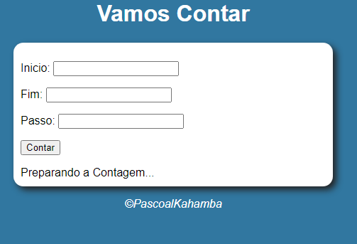
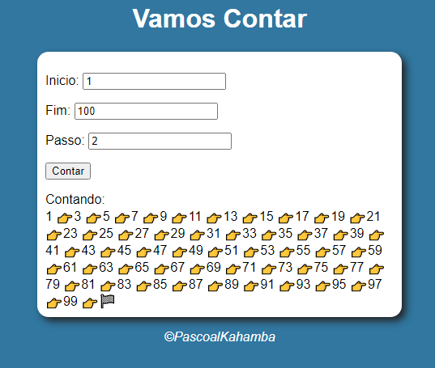
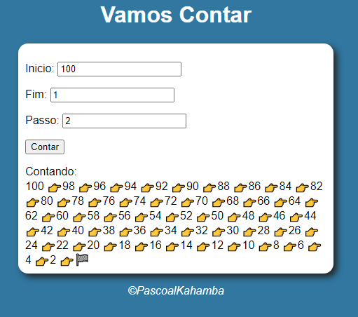

# Super Contador

Este `projeto` foi criado para fins de exercícios em `Javascript`. Este projeto tem a função de contar números funciana da seguinte forma o projeto tem três campos a serem preenchidos que são de carecter `obrigatório` falando dos três campos o primeiro que é o `Inicio` recebe o valor inical, o segundo `Fim` recebe o valor final, e o ultimo `Passo` corresponde a quantas casas `decimais` vai pulando até terminar de contar. Caso contrário vai dar um `erro` vindo a segunte mensagem em baixo `Impossivel Contar!` mas a um porem no ultimo campo que é o `passo` se colores `valores invalidos` ou seja valores igual ou menor que `zero` também vai retornar um erro com a seguinte informação `[ERRO] Passo invado! Considerando passo 1` é isso mesmo vindo este erro o campo passo vai receber automaticamente o `valor 1`. Então o projeto conta de duas formas diferente uma de forma `crescente` outra de forma `decrescente` a forma de contar vai depender dos dados digitados pelo `usuário`, para contar de forma crescente o inicio tem que ser menor que o fim lendo da seguinte forma `de x até x` ou seja `do inicio até o fim`, o passo é opcional desde que seja um `valor` valido. Já para contar de forma decrescente tem que ser o `contrário` ou seja o inicio tem que ser maior que o fim então ele vai partir desde o fim tirando valores que corresponde ao passo até chegar no valor do inicio.

## Tecnologias

As seguintes ferramentas foram usadas na constuição deste projeto:

- HTML
- CSS
- JAVASCRIPT

#

Feito por ❤ Pascoal Kahamba meu [Linkedin](https://www.linkedin.com/in/pascoal-kahamba-7b43bb233?lipi=urn%3Ali%3Apage%3Ad_flagship3_profile_view_base_contact_details%3BTg8LEKayToyytOX1pVAQ%2Bg%3D%3D)

[👉Clique aqui se desejas ver aplicação rodando.👈😎](https://super-contador.vercel.app/)
